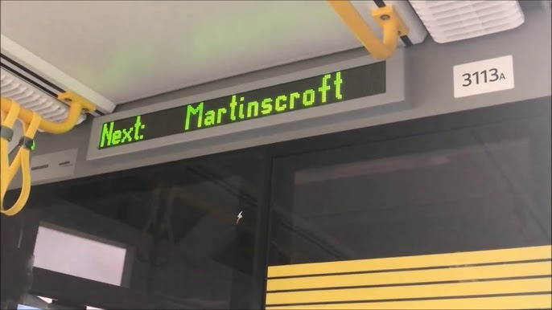
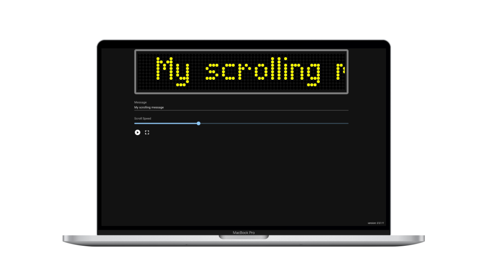
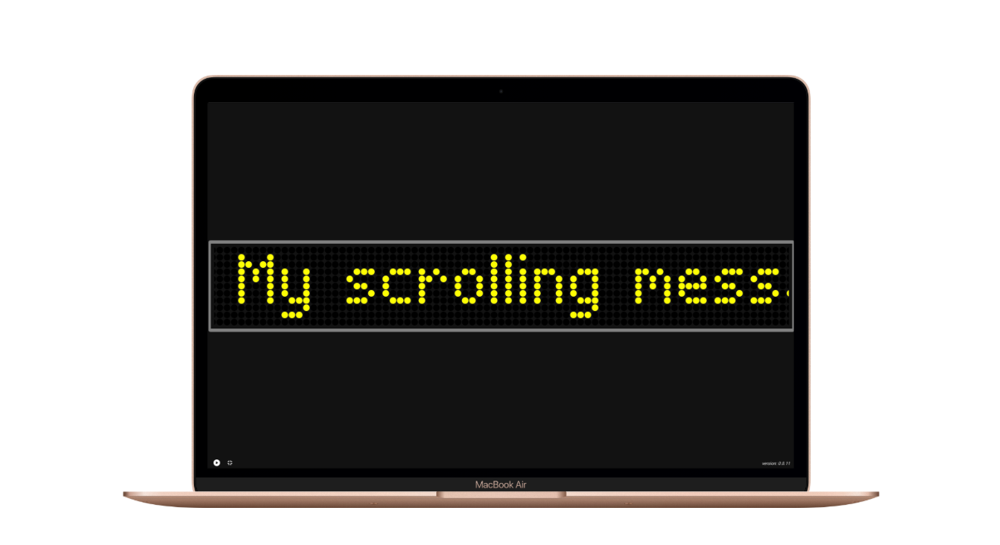
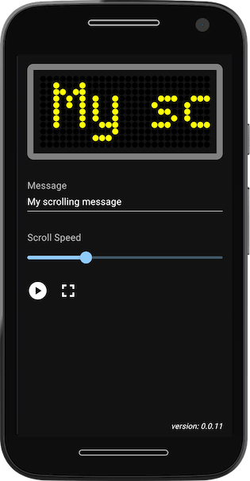
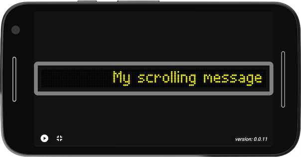

# Description

I travel on the Metrolink several times per week and have often thought about implementing a scrolling LED matrix display, using React and SVG, to look a bit like the matrix displays on the trams. I finally got round to it.

# Screenshots

### Normal view on a MacBook Pro 16

### Fullscreen view on a MacBook Air

### Normal view in portrait mode on a Moto G4

### Fullscreen view in landscape mode on a Moto G4

# Links

* [Manchester Metrolink](https://en.wikipedia.org/wiki/Manchester_Metrolink) (Wikipedia)
* [Bee Network](https://en.wikipedia.org/wiki/Bee_Network) (Wikipedia)
* [Transport for Greater Manchester](https://tfgm.com/)
* https://typofoto.wordpress.com/2014/06/19/dot-matrix-fonts/
* https://github.com/petykowski/London-Underground-Dot-Matrix-Typeface/blob/master/resources/examples/London-Underground-Medium.png
  * _TODO_
* [Device Shots — Free Device Mockup Design Generator](https://deviceshots.com/)
* Promising looking PDF: [TfGM Developer Portal](https://www.greatermanchester-ca.gov.uk/media/3948/tfgm-developer-portal.pdf)
  * However: [Open Data Portal](https://tfgm.com/data-analytics-and-insight/open-data-portal)
  * But: [https://beenetwork-dev.api-tf.tfgm.com/](https://beenetwork-dev.api-tf.tfgm.com/)
  * And: [https://beenetwork-staging.api-tf.tfgm.com/](https://beenetwork-staging.api-tf.tfgm.com/)
