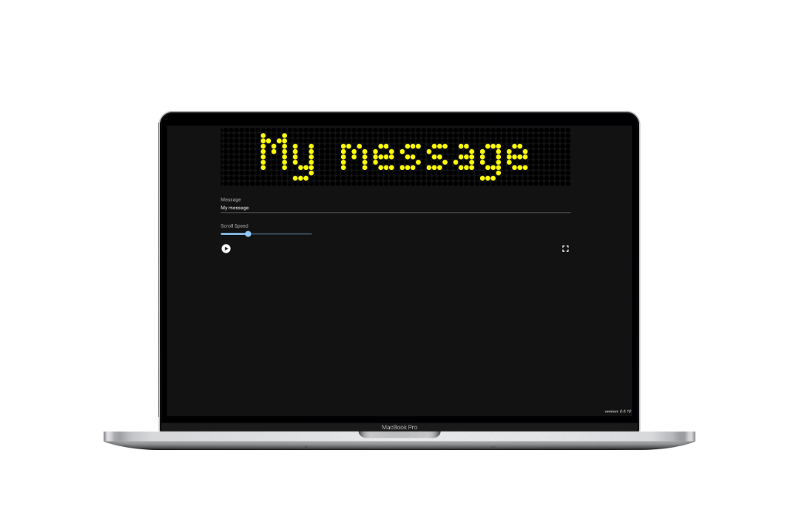
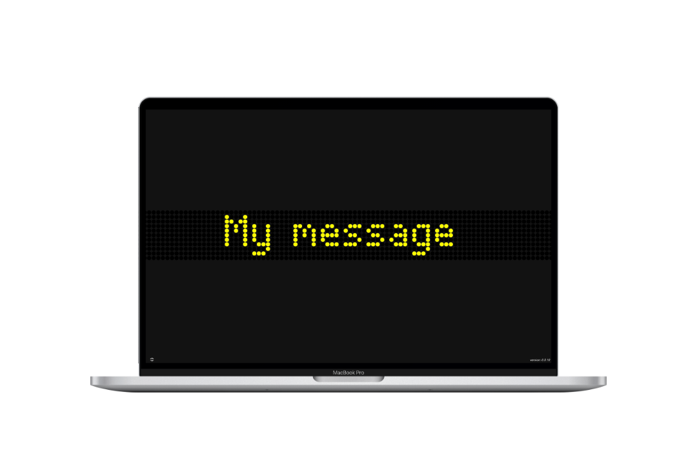
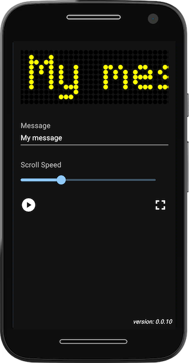
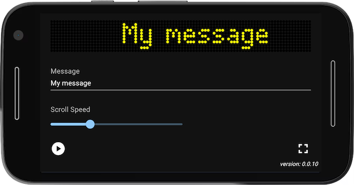

# Description

I travel on the Metrolink several days a week and have often thought about implementing an LED matrix display in React to look a bit like the matrix displays on the trams. I finally got round to it.

# Screenshots

### Normal view on a MacBook Pro 16

### Fullscreen view on a MacBook Pro 16

### Prortait mode on a Moto G4

### Landscape mode on a Moto G4

# Links

* [Manchester Metrolink](https://en.wikipedia.org/wiki/Manchester_Metrolink) (Wikipedia)
* [Bee Network](https://en.wikipedia.org/wiki/Bee_Network) (Wikipedia)
* [Transport for Greater Manchester](https://tfgm.com/)
* https://typofoto.wordpress.com/2014/06/19/dot-matrix-fonts/
* https://github.com/petykowski/London-Underground-Dot-Matrix-Typeface/blob/master/resources/examples/London-Underground-Medium.png
  * _TODO_
* [Device Shots — Free Device Mockup Design Generator](https://deviceshots.com/)
